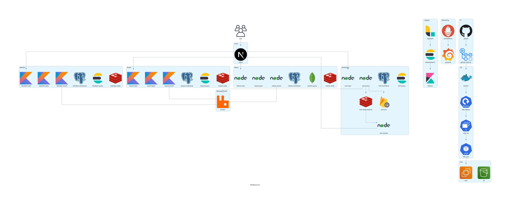
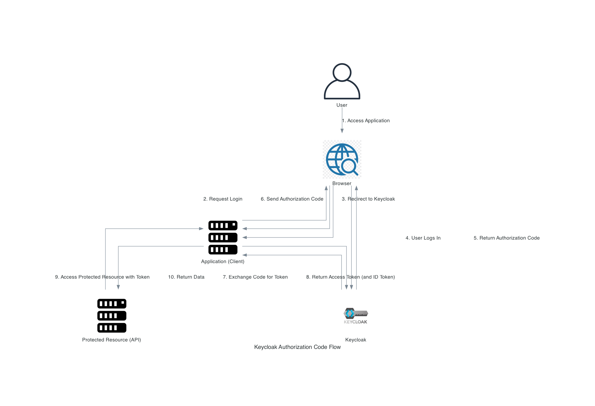
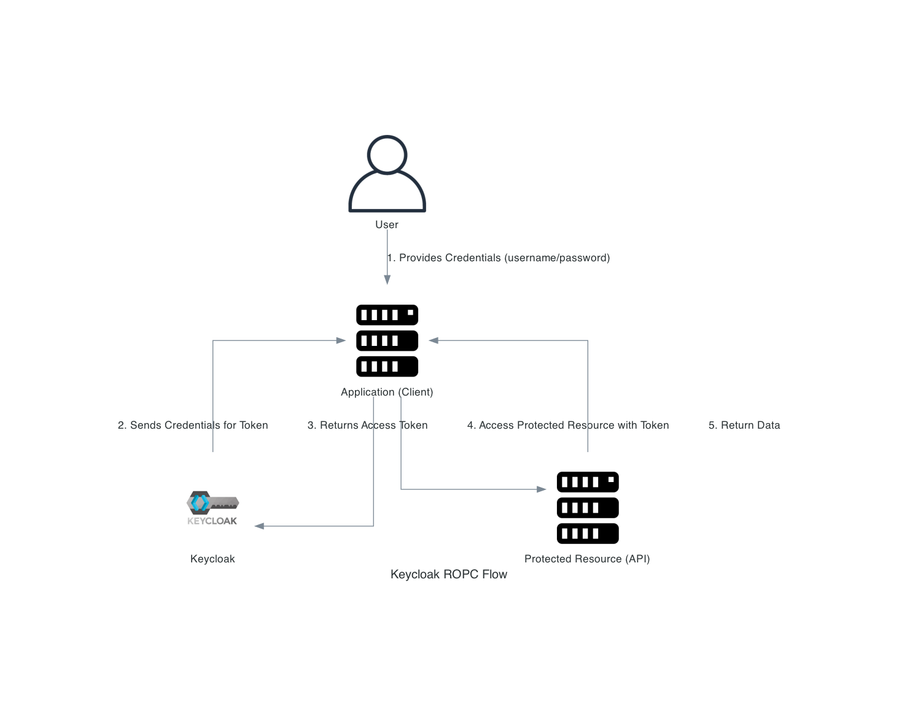

# choimory-architecture

- 다양한 아키텍쳐들을 diagrams(https://diagrams.mingrammer.com) 를 이용해 파이썬 코드로 작성함 
- ~~draw.io 너무 귀찮다~~

# 환경구성

## 시작 전 설치

```shell
# python3
brew install python
python3 --version

# grapviz, 다이어그램 그리는 툴
brew install graphviz
dot -V
```

- brew로 python, graphviz 설치

## 아키텍쳐별 디렉토리, 실행파일 및 파이썬 가상환경 생성

```shell
mkdir <directory_path>
cd <directory_path>
touch <file_name>.py
python3 -m venv venv
```

- 디렉토리 생성 후 파이썬 파일 생성하고 파이썬 가상환경을 설치함

## 디렉토리별 라이브러리 설치

```shell
source venv/bin/activate
pip install diagrams
```

- 디렉토리안의 가상환경에 파이썬 라이브러리 설치함

## 디렉토리별 가상환경 시작

```shell
cd <directory_path>
source venv/bin/activate
```

- 해당 디렉토리의 가상환경 실행함

## 이미지 생성

```shell
cd <directory_path>
python3 <file_name>.py
```

- 파일 실행하여 이미지 생성함

## 종료

`deactivate`

---

# architect

## choimory-io



- 개인 토이프로젝트 choimory-io의 전체 구성

## keycloak flow



- auth code flow



- ropc flow